# 물류 프로젝트 DB 관계도 초안

이 문서는 현재 워크스페이스의 코드에서 **직접 읽힌 엔티티/테이블명/컬럼명**을 기준으로 그린 **상위 관계도 초안**입니다.

> 중요
> - 이 문서는 실제 DB의 전체 ERD가 아닙니다.
> - 특히 `fizz-api`, `fizz-wcs-api`는 Spring Data JDBC 기반 DO가 많아서, DB FK 제약조건이 코드에 명시되지 않은 경우가 많습니다.
> - 따라서 아래 관계도는 **[명시적]** / **[추론]** 을 구분해 읽는 것이 안전합니다.

---

## 1. 한눈에 보는 전체 구조

```mermaid
erDiagram
    MDM_CENTERS {
        UUID uuid
        STRING center_id
        STRING service_id
    }

    MDM_SHIPPERS {
        UUID uuid
        STRING shipper_id
        STRING service_id
    }

    MDM_ITEMS {
        UUID uuid
        STRING item_id
        STRING shipper_id
        STRING service_id
    }

    MDM_DELIVERY_COMPANIES {
        UUID uuid
        STRING delivery_company_id
    }

    LMD_SHIPPER_CONTRACTS {
        UUID lmd_shipper_contract_uuid
        UUID mdm_center_uuid
        UUID mdm_shipper_uuid
        STRING service_id
    }

    LMD_SHIPPER_API_CONFIGS {
        UUID lmd_shipper_api_config_uuid
        UUID lmd_shipper_contract_uuid
        UUID lmd_delivery_company_api_uuid
    }

    LMD_DELIVERY_COMPANY_APIS {
        UUID lmd_delivery_company_api_uuid
        UUID mdm_delivery_company_uuid
        STRING service_id
    }

    LMD_HAWB_NUMBERING_RULES {
        UUID uuid
        UUID shipper_contract_uuid
    }

    SM_RATE_HEADERS {
        UUID uuid
        STRING rate_id
        STRING shipper_id
        STRING center_id
    }

    SM_RATE_DETAILS {
        UUID uuid
        UUID header_uuid
        STRING rate_id
        STRING shipper_id
    }

    SM_SETTLEMENT_TARGETS {
        UUID uuid
        STRING shipper_id
        STRING center_id
        STRING hbl_number
        STRING mbl_number
    }

    SM_SETTLEMENT_RESULTS {
        UUID uuid
        UUID rate_uuid
        STRING shipper_id
        STRING center_id
        STRING hbl_number
        STRING mbl_number
        STRING bill_id
    }

    SM_INVOICE_HEADERS {
        STRING xblnr
        STRING gjahr
    }

    SM_INVOICE_DETAILS {
        STRING xblnr
        STRING gjahr
        STRING buzei
    }

    OMS_CENTERS {
        UUID id
        STRING center_id
    }

    OMS_OWNERS {
        UUID id
        STRING owner_id
        STRING prnt_owner_id
    }

    OMS_CENTER_OWNER_MAP {
        UUID id
        STRING center_id
        STRING owner_id
    }

    OMS_MBL {
        UUID id
        STRING mbl_no
        STRING center_id
        STRING prnt_owner_id
    }

    OMS_HBL {
        UUID id
        STRING rep_hawb_no
        STRING mbl_no
        STRING owner_id
        STRING center_id
    }

    OMS_HBL_PARTY {
        UUID id
        STRING owner_id
        STRING rep_hawb_no
        STRING cust_ord_no
    }

    WCS_PLAN_INV {
        STRING center_cd
        STRING inv_no
        STRING sort_id
        STRING sm_no
    }

    WCS_PLAN_INV_WMS_IF {
        LONG if_no
        STRING center_cd
        STRING inv_no
        STRING sort_id
    }

    WCS_EQP_MASTER {
        STRING center_cd
        STRING eqp_id
        STRING zone_id
        STRING location_cd
    }

    WCS_CHUTE_MAP {
        STRING center_cd
        STRING eqp_id
        STRING chute_id
        STRING tsk_btch_id
    }

    WCS_TASK_WORK {
        STRING center_cd
        STRING eqp_id
        STRING tsk_btch_id
        STRING tsk_id
        STRING wrk_id
        STRING chute_id
    }

    WCS_SCAN_RESULT_IF {
        LONG if_no
        STRING center_cd
        STRING inv_no
        STRING wcs_id
    }

    MDM_SHIPPERS ||--o{ MDM_ITEMS : "shipper_id [추론]"
    MDM_CENTERS ||--o{ LMD_SHIPPER_CONTRACTS : "mdm_center_uuid [추론]"
    MDM_SHIPPERS ||--o{ LMD_SHIPPER_CONTRACTS : "mdm_shipper_uuid [추론]"
    MDM_DELIVERY_COMPANIES ||--o{ LMD_DELIVERY_COMPANY_APIS : "mdm_delivery_company_uuid [추론]"

    LMD_SHIPPER_CONTRACTS ||--o| LMD_SHIPPER_API_CONFIGS : "lmd_shipper_contract_uuid [계약측 optional, 명시적 join]"
    LMD_DELIVERY_COMPANY_APIS ||--o{ LMD_SHIPPER_API_CONFIGS : "lmd_delivery_company_api_uuid [추론]"
    LMD_SHIPPER_CONTRACTS ||--o| LMD_HAWB_NUMBERING_RULES : "shipper_contract_uuid [명시적 컬럼]"

    SM_RATE_HEADERS ||--o{ SM_RATE_DETAILS : "header_uuid [명시적]"
    SM_SETTLEMENT_TARGETS ||--o{ SM_SETTLEMENT_RESULTS : "동일 정산 식별자 후보 공유 [추론]"
    SM_RATE_HEADERS ||--o{ SM_SETTLEMENT_RESULTS : "rate_uuid 관련 [약한 추론]"
    SM_INVOICE_HEADERS ||--o{ SM_INVOICE_DETAILS : "복합키 일부(xblnr, gjahr 포함) [추론]"

    OMS_CENTERS ||--o{ OMS_CENTER_OWNER_MAP : "center_id [추론]"
    OMS_OWNERS ||--o{ OMS_CENTER_OWNER_MAP : "owner_id [추론]"
    OMS_OWNERS ||--o{ OMS_HBL : "owner_id [추론]"
    OMS_CENTERS ||--o{ OMS_HBL : "center_id [추론]"
    OMS_MBL ||--o{ OMS_HBL : "mbl_no [추론]"
    OMS_HBL ||--o| OMS_HBL_PARTY : "owner_id+rep_hawb_no+cust_ord_no 기준의 확장정보 후보 [약한 추론]"

    WCS_PLAN_INV_WMS_IF ||--o| WCS_PLAN_INV : "center_cd+inv_no+sort_id 공유 [추론]"
    WCS_EQP_MASTER ||--o{ WCS_CHUTE_MAP : "center_cd+eqp_id [추론]"
    WCS_EQP_MASTER ||--o{ WCS_TASK_WORK : "center_cd+eqp_id [추론]"
    WCS_CHUTE_MAP ||--o{ WCS_TASK_WORK : "tsk_btch_id/chute_id [약한 추론]"
    WCS_PLAN_INV ||--o{ WCS_SCAN_RESULT_IF : "inv_no 중심의 후행 결과 후보 [약한 추론]"
```



---

## 2. 저장소별 핵심 관계

### A. `mdm-api` — 기준정보(MDM)

핵심 테이블 후보
- `centers`
- `shippers`
- `items`
- `delivery_companies`

관계 메모
- `items.shipper_id`가 존재하므로, **아이템은 화주(Shipper) 기준으로 관리**되는 구조로 읽힙니다. **[추론]**
- `centers`, `shippers`, `delivery_companies`는 다른 시스템이 참조하는 마스터 테이블 역할에 가깝습니다.

근거 파일
- `mdm-api/.../CenterEntity.kt`
- `mdm-api/.../ShipperEntity.kt`
- `mdm-api/.../ItemEntity.kt`
- `mdm-api/.../DeliveryCompanyEntity.kt`

### B. `e-falcon-lmd-api` — 화주 계약 / 배송사 API 설정

핵심 테이블 후보
- `shipper_contracts`
- `shipper_api_configs`
- `delivery_company_apis`
- `shipper_hawb_numbering_rules`

관계 메모
- `shipper_api_configs.lmd_shipper_contract_uuid -> shipper_contracts`는 `@OneToOne` + `@JoinColumn`으로 **명시적**입니다.
- 다만 이것이 **모든 계약이 반드시 API 설정을 가진다**는 뜻까지 보장하진 않으므로, 관계도에서는 계약측 optional로 보는 것이 안전합니다.
- `shipper_hawb_numbering_rules.shipper_contract_uuid -> shipper_contracts`는 컬럼과 엔티티 참조가 있어 **강한 근거**가 있습니다.
- `shipper_contracts.mdm_center_uuid`, `shipper_contracts.mdm_shipper_uuid`는 이름상 MDM의 `centers`, `shippers`를 참조하는 구조로 보입니다. **[추론]**
- `delivery_company_apis.mdm_delivery_company_uuid`는 MDM의 배송사 기준정보를 연결하는 역할로 보입니다. **[추론]**

### C. `sm-api` — 정산 / 요율 / 인보이스

핵심 테이블 후보
- `sm.sm_target_tb`
- `sm.sm_result_tb`
- `sm.mdm_rate_header_tb`
- `sm.mdm_rate_detail_tb`
- `sm.tbcc_if_fi_doc_header`
- `sm.tbcc_if_fi_doc_det`

관계 메모
- `mdm_rate_detail_tb.header_uuid -> mdm_rate_header_tb.uuid`는 컬럼명상 매우 분명합니다.
- `sm_target_tb`와 `sm_result_tb`는 `service_id`, `shipper_id`, `center_id`, `hbl_number`, `mbl_number`, `bill_ym`를 공유하므로 **같은 정산 대상을 식별하는 후보 키 집합을 공유**한다고 읽는 것이 자연스럽습니다. **[추론]**
- `sm_result_tb.rate_uuid`는 요율 테이블과 연결되지만, 헤더/디테일 중 정확히 어느 쪽인지 파일 하나만으로는 단정하기 어렵습니다. **[약한 추론]**
- 인보이스 헤더/디테일은 이름과 복합키 설명상 **헤더 1:N 디테일** 구조로 읽힙니다. **[추론]**
- 다만 키 설명은 단순히 `xblnr + gjahr` 수준이 아니라, 헤더는 `compCd + lgsys + xblnr + gjahr + xnegp`, 디테일은 여기에 `buzei`가 추가되는 복합키입니다.
- `sm_result_tb -> invoice header/detail` 직접 연결은 이번에 읽은 엔티티만으로는 명확하지 않아서, 관계도에서는 별도 직접선으로 단정하지 않았습니다.

### D. `fizz-api` — OMS / 주문 / 통관 / 배송

핵심 테이블 후보
- `tb_mbl`
- `tb_hbl`
- `tb_hbl_party`
- `tb_owner_m`
- `tb_center_m`
- `tb_center_owner_m`

관계 메모
- `tb_mbl.mbl_no`와 `tb_hbl.mbl_no`가 대응하므로, **MBL 1:N HBL** 구조로 읽는 것이 자연스럽습니다. **[추론]**
- `tb_hbl.owner_id -> tb_owner_m.owner_id`는 명명상 자연스럽고, HBL이 owner 기준으로 관리됩니다. **[추론]**
- `tb_hbl.center_id -> tb_center_m.center_id`도 같은 방식으로 읽힙니다. **[추론]**
- `tb_center_owner_m(center_id, owner_id)`는 **센터-화주(또는 운영주체) 연결 테이블** 역할입니다.
- `tb_hbl_party`는 `owner_id + rep_hawb_no + cust_ord_no`를 같이 들고 있어, HBL의 당사자/주문자/수하인 상세 확장 정보로 보는 것이 자연스럽습니다. **[약한 추론]**
- 다만 이것을 DB 차원의 엄격한 `HBL 1:N` 관계라고 단정할 근거는 현재 읽은 파일만으로는 부족합니다.

### E. `fizz-wcs-api` — WCS / 설비 / 작업 / 스캔결과

핵심 테이블 후보
- `tbe_plan_inv_i`
- `tie_plan_inv_info_wms_r_i`
- `tbe_comn_eqp_m`
- `tbe_comn_chute_mpng_m`
- `tbe_task_wrk_i`
- `tie_rslt_job_parcel_s_i`

관계 메모
- `tie_plan_inv_info_wms_r_i`는 이름 그대로 **WMS 수신 인터페이스 테이블**, `tbe_plan_inv_i`는 **내부 작업계획/송장 테이블**로 읽힙니다.
- 둘 다 `center_cd`, `inv_no`, `sort_id`를 가지므로, **WMS 수신 데이터가 내부 plan invoice로 적재/정규화**되는 흐름으로 보는 것이 자연스럽습니다. **[추론]**
- `tbe_comn_eqp_m(center_cd, eqp_id)`는 설비 마스터이고, `tbe_task_wrk_i`가 동일 키를 가지므로 **설비 1:N 작업실적** 구조로 읽힙니다. **[추론]**
- `tbe_comn_chute_mpng_m(center_cd, eqp_id, chute_id, tsk_btch_id)`는 설비와 chute를 연결하는 매핑 테이블입니다.
- `tie_rslt_job_parcel_s_i.inv_no`는 스캔/전송 결과 인터페이스 성격이 강해서, plan 쪽 송장 데이터와 연결된 후행 결과 테이블로 보면 이해가 쉽습니다. **[약한 추론]**
- 반면 `tbe_task_wrk_i`에는 `inv_no`가 직접 보이지 않으므로, `task_work -> scan_result_if`를 직접 DB 관계처럼 읽는 것은 조심해야 합니다.

---

## 3. 신규 입사자 관점에서 이해하면 좋은 흐름

### 흐름 1) 기준정보 → 계약/운영설정
`MDM(shippers, centers, delivery_companies)`
→ `LMD(shipper_contracts, shipper_api_configs)`

의미
- 기준 화주/센터/배송사 정보가 먼저 있고,
- 그 위에 실제 계약과 API 연동 설정이 붙는 구조입니다.

### 흐름 2) 주문/운송 문서
`OMS_MBL`
→ `OMS_HBL`
→ `OMS_HBL_PARTY`

의미
- 상위 운송단위(MBL) 아래 개별 운송/주문 단위(HBL/HAWB)가 있고,
- 그 아래 주문자/송하인/수하인/PCC 같은 당사자 정보가 붙습니다.

### 흐름 3) 정산
`SM_RATE_HEADERS`
→ `SM_RATE_DETAILS`
→ `SM_SETTLEMENT_TARGETS`
→ `SM_SETTLEMENT_RESULTS`
→ `SM_INVOICE_HEADERS / DETAILS`

의미
- 요율표가 있고,
- 정산 대상이 들어오면,
- 정산 결과가 생성되고,
- 최종적으로 인보이스 인터페이스 데이터가 나가는 구조로 이해할 수 있습니다.

### 흐름 4) WMS → WCS 현장 처리
`WCS_PLAN_INV_WMS_IF`
→ `WCS_PLAN_INV`
→ `WCS_TASK_WORK`
→ `WCS_SCAN_RESULT_IF`

의미
- 외부 WMS 지시가 들어오고,
- 내부 작업 계획으로 바뀌고,
- 설비 작업이 수행되고,
- 스캔/처리 결과가 저장 또는 전송됩니다.

---

## 4. 지금 기준으로 가장 그럴듯한 핵심 연결선만 따로 보면

```text
MDM.shippers ─────┐
                  ├─> LMD.shipper_contracts ──> LMD.shipper_api_configs
MDM.centers ──────┘                                 │
                                                    └─> LMD.delivery_company_apis

OMS.tb_mbl ──> OMS.tb_hbl ──> OMS.tb_hbl_party
OMS.tb_owner_m ───────────┘
OMS.tb_center_m ──────────┘
OMS.tb_center_m ──< OMS.tb_center_owner_m >── OMS.tb_owner_m

SM.mdm_rate_header_tb ──> SM.mdm_rate_detail_tb
SM.sm_target_tb ──> SM.sm_result_tb
SM.tbcc_if_fi_doc_header ──> SM.tbcc_if_fi_doc_det

WCS.tie_plan_inv_info_wms_r_i ──> WCS.tbe_plan_inv_i
WCS.tbe_comn_eqp_m ──> WCS.tbe_task_wrk_i
WCS.tbe_comn_eqp_m ──> WCS.tbe_comn_chute_mpng_m
WCS.tbe_plan_inv_i ──> WCS.tie_rslt_job_parcel_s_i
```

---

## 5. 가장 먼저 확인하면 좋은 포인트

실제 ERD를 더 정확히 만들려면 아래를 팀에 확인하면 됩니다.

1. `sm_result_tb.rate_uuid`가 `mdm_rate_header_tb.uuid`인지 `mdm_rate_detail_tb.uuid`인지
2. `tb_hbl_party`의 실제 PK/UK가 무엇인지
3. `tb_mbl` ↔ `tb_hbl`가 DB FK로도 묶여 있는지, 아니면 애플리케이션 레벨 연결인지
4. `shipper_contracts.mdm_center_uuid`, `mdm_shipper_uuid`가 실제 MDM UUID FK인지
5. WCS의 `plan/task/result` 테이블이 실제로 어떤 배치키(`tsk_btch_id`, `inv_no`, `eqp_id`)를 기준으로 연결되는지

---

## 6. 근거로 읽은 대표 파일

- `e-falcon-lmd-api/.../ShipperContractEntity.kt`
- `e-falcon-lmd-api/.../ShipperApiConfigEntity.kt`
- `e-falcon-lmd-api/.../ShipperHawbNumberingRuleEntity.kt`
- `e-falcon-lmd-api/.../DeliveryCompanyApiEntity.kt`
- `mdm-api/.../CenterEntity.kt`
- `mdm-api/.../ShipperEntity.kt`
- `mdm-api/.../ItemEntity.kt`
- `mdm-api/.../DeliveryCompanyEntity.kt`
- `sm-api/.../SettlementTargetJpaEntity.kt`
- `sm-api/.../SettlementResultJpaEntity.kt`
- `sm-api/.../RateHeaderJpaEntity.kt`
- `sm-api/.../RateDetailJpaEntity.kt`
- `sm-api/.../InvoiceHeaderJpaEntity.kt`
- `sm-api/.../InvoiceDetailJpaEntity.kt`
- `fizz-api/.../TbMblDO.kt`
- `fizz-api/.../TbHblDO.kt`
- `fizz-api/.../TbHblPartyDO.kt`
- `fizz-api/.../TbOwnerMDO.kt`
- `fizz-api/.../TbCenterMDO.kt`
- `fizz-api/.../TbCenterOwnerMDO.kt`
- `fizz-wcs-api/.../TbePlanInvIDO.kt`
- `fizz-wcs-api/.../TiePlanInvInfoWmsRIDO.kt`
- `fizz-wcs-api/.../TbeComnEqpMDO.kt`
- `fizz-wcs-api/.../TbComnChuteMpngMDO.kt`
- `fizz-wcs-api/.../TbeTaskWrkIDO.kt`
- `fizz-wcs-api/.../TieRsltJobParcelSIDO.kt`
